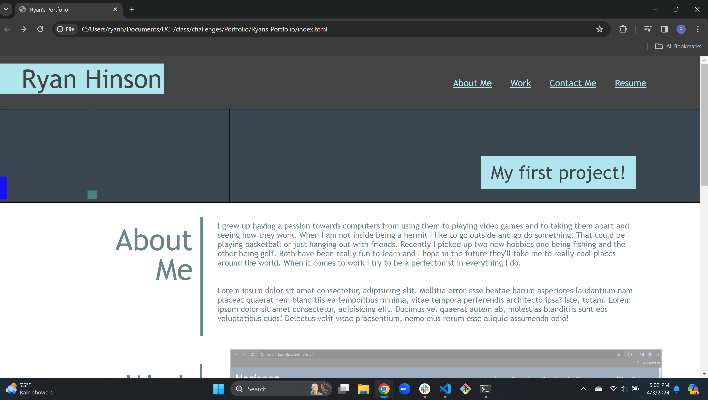
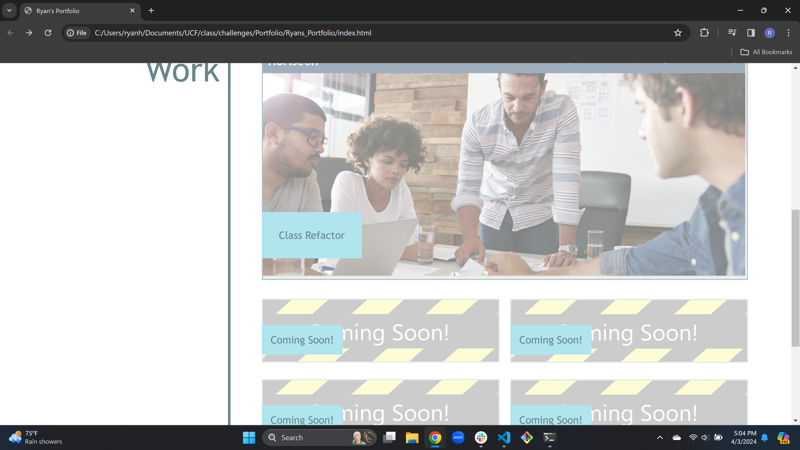
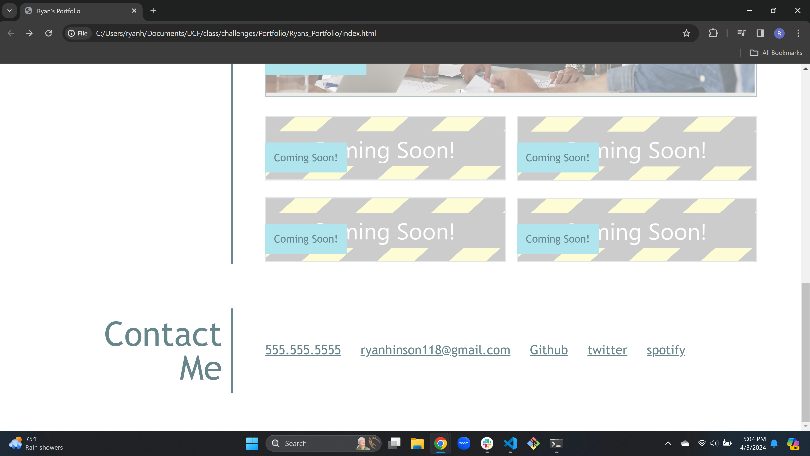

# Ryans_Portfolio

## Description

I was motivated in making this portfolio so potential employer's could see my work and skill level. My goal was to make a visually apealing website that was easy to naviagte. Throughout this challenge I learned a lot about css and what certain things do better than before. The main ones where flexboxs, positioning and float. I also better understood my fundamental knowledge in css in doing this challenge. Media queries was something else I learned better.

## Website Link

https://ryanh118.github.io/Ryans_Portfolio/

## Usage

